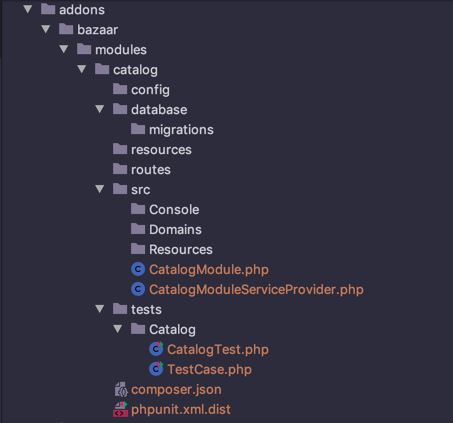

# Modules
Modules are the most inclusive and generally used addon type. Inside the modules folder, directory structure is almost identical to a Laravel project with one exception which is the `src` is used instead of `app`:

```
catalog
|-- database
    |-- migrations
|-- resources
|-- routes
|-- src
    |-- Console
    |-- Resources
    +-- CatalogModule.php
    +-- CatalogModuleServiceProvider.php
|-- tests
    |-- Catalog
        +-- CatalogTest.php
        +-- TestCase.php
+-- composer.json
+-- phpunit.xml.dist
```

## Creating a Module
By saying _creating_ we mean to create the necessary files and folders for our module addon. 
Before diving into addon creation, we must note that every addon we create must have a unique name throughout the application. 

Having said that, let's create the `catalog module` of our e-commerce application using `bazaar` as vendor and `catalog` as the unique addon name:

```bash 
 php artisan make:module bazaar.catalog
```

This would create the following files and folders:



And here's `composer.json` file created, with type parameter `superv-module` indicating that this is a special type of composer package.

```json 
{
    "name": "bazaar/catalog",
    "type": "superv-module",
    "autoload": {
        "psr-4": {
            "Bazaar\\Modules\\Catalog\\": "src/"
        }
    },
    "autoload-dev": {
        "psr-4": {
            "Tests\\": "tests"
        }
    },
    "require": {
        "superv/platform": "*"
    }
}
```

## Installing a Module

Addons must be installed in order to boot along with the superV platform:

```bash
 php artisan addon:install addons/bazaar/modules/catalog
```

When installing an addon, the innstaller will run all the migrations located in your addon's `database/migrations` folder.

While developing an addon, you can tweak your migrations then run `addon:reinstall` command to uninstall and install again. And also `addon:uninstall` to just uninstall to completely remove it. 

<div class="alert alert--danger">
‼ Note that, uninstalling an addon rollbacks all it's migrations, thus would drop related database tables.
</div>
