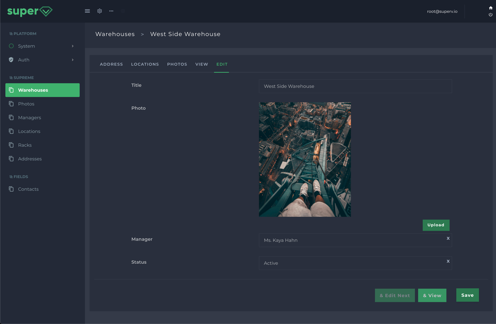
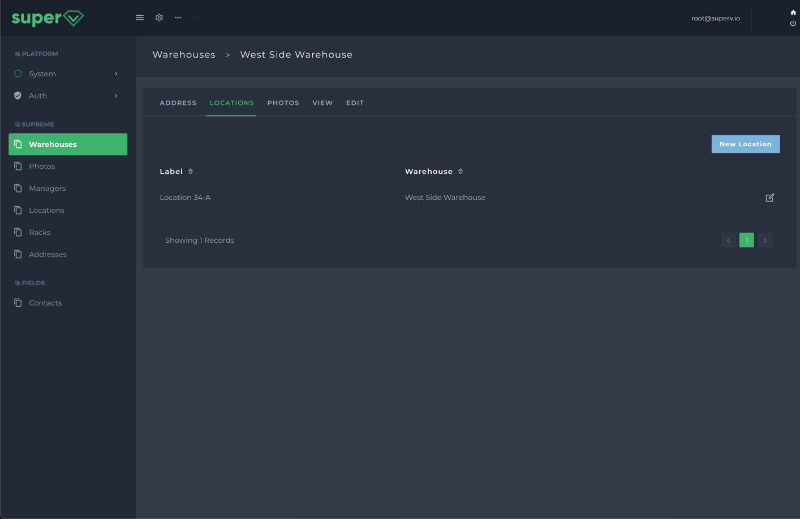

# Introduction
Control panels, lists and forms. They are essential in every web application. But the more your app grows the more you spend more on these instead of focusing on your main business logic. 

There are many solutions for this problem out there and yet superV is one of them but off course with many subtle differences.

First of all with near to zero configuration you can fire up a Vue powered SPA control panel within seconds without writing a single line of code other than some trivial modifications in your database migrations.

The main power of superV comes from that it does not generate any files for your lists, forms and other resource related pages. The data that is needed to create frontend Vue components are rendered on the fly. But during this process you can hook onto nearly every point and customize the data to tailor your needs.


### How is it different?
- superV does not generate nor require any files for your resources.
- You can create multiple frontend panels with different authorization layers.

superV turns this migration:
```php
<?php

use SuperV\Platform\Domains\Database\Migrations\Migration;
use SuperV\Platform\Domains\Database\Schema\Blueprint;
use SuperV\Platform\Domains\Resource\ResourceConfig as Config;
use Supreme\Modules\Core\Domains\WarehouseStatus;

class CreateWarehousesTable extends Migration
{
    public function up()
    {
        $this->create('supreme_warehouses',
            function (Blueprint $table, Config $config) {
                $config->label('Warehouses');
                $config->setName('warehouses');
                $config->nav('acp.supreme');

                $table->increments('id');
                $table->string('title')->unique()->entryLabel();

                $table->image('photo', 'warehouses');

                $table->nullableBelongsTo('core.managers', 'manager')->showOnIndex();

                $table->morphOne('core.addresses', 'address', 'owner')->nullable();

                $table->status(WarehouseStatus::class)->default(WarehouseStatus::active());
                $table->hasMany('core.locations', 'locations');
                $table->morphMany('core.photos', 'photos', 'owner');

                $table->updatedBy();
            });
    }

    public function down()
    {
        $this->dropIfExists('supreme_warehouses');
    }
}
```

...into this entry dashboard with relations and all:



